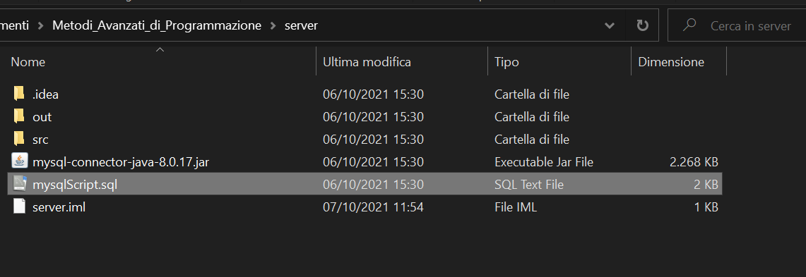
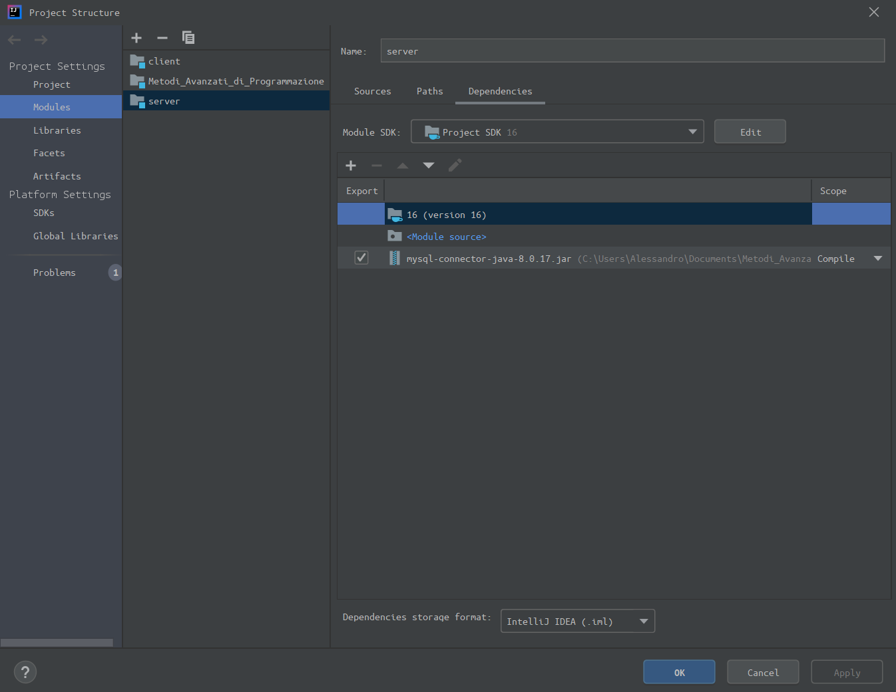
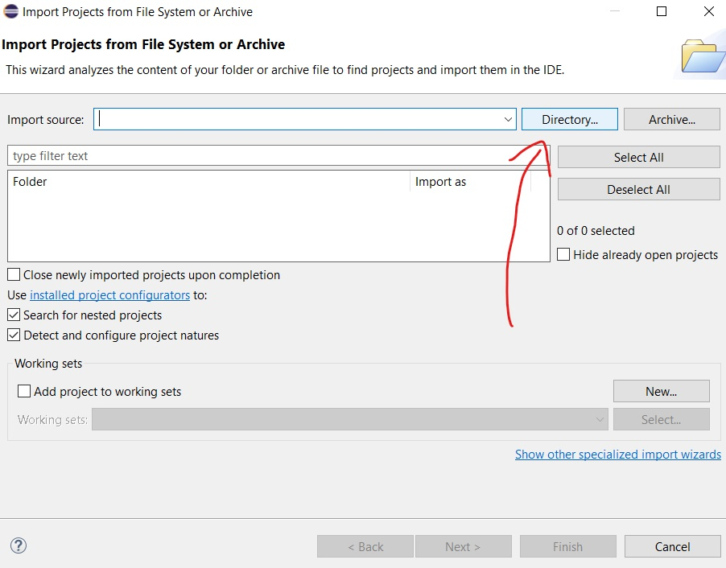
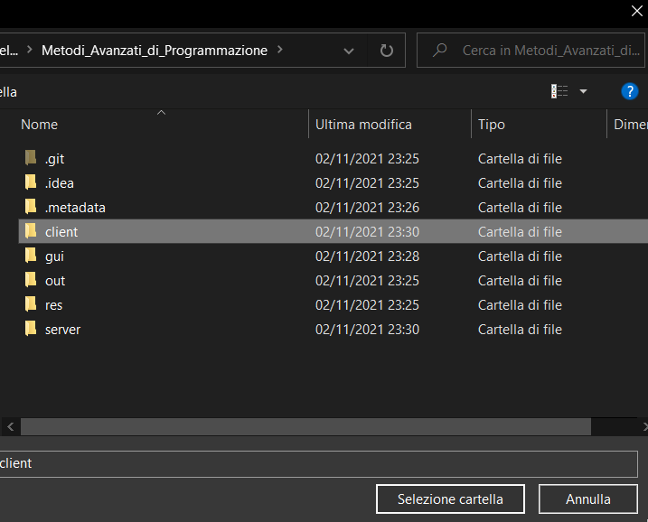

# _GUIDA PER LA COMPATIBILITA'_ (versione progetto con estensione)

## REQUISITI:
    -mySQL versione 8.0
    -IntelliJ oppure Eclipse
    -JavaFx

C'è da sapere che il progetto, naturalmente, si divide in parte client e parte server. Il server si appoggia ad un __database__ che va, ovviamente, eseguito.

## SQL:
Per eseguire il database, copiare il file "mySqlScript.sql" dalla directoy del progetto:

Per fare questo premere il tasto windows sulla tastiera

Cercare
>mysql 8.0 command line client

premere sulla scritta
>Apri percorso file

premere il tasto destro sull'applicazione chiamata
>MySQL 8.0 Command Line Client

premere sull'opzione 
>Apri percorso file

Incollare il file "mySqlScript.sql" in questa cartella:

__CONSIGLIO VIVAMENTE DI RINOMINARLO CON UN NOME SEMPLICE, NOI CONSIGLIAMO IL NOME "MAP.SQL"__

Una volta completata la copia, eseguire _mySql 8.0 Command Line Client_.

Inserita la password, eseguire il comando "source _nomeFile_.sql" (_nomeFile_ deve essere il nome da voi inserito)

---
 

# GUIDA INTELLIJ

## JAR FILE:
Sarà necessario istruire il nostro IDE (Intellij) affinchè conosca la precisa locazione del driver, di supporto all'integrazione del database.

Il nostro driver è:

Aprire INTELLIJ e cliccare su: 
__FILE__ -> __PROJECT STRUCTURE__ (CTRL+ALT+SHIFT+S).

Nella pagina "Modules", ci saranno le cartelle:

    - Client

    - Server

    - Metodi_Avanzati_di_Programmazione

__Per la cartella "SERVER"__, bisognerà aggiungere il file .jar nella lista di moduli da esportare, checkarli come nell'immagine (mantenendo lo scope "Compile") e applicare le modifiche.

A questo punto abbiamo terminato.

Per risolvere gli eventuali ulteriori problemi, come al solito, basterà invalidare le cache (File --> invalidate caches).

---
 

# GUIDA ECLIPSE

Se si utilizza eclipse invece la procedura risulta molto più semplice, in quanto basterà importare il progetto.

Una volta aperto Eclipse, basta cliccare in alto a sinistra su __FILE__ -> __OPEN PROJECTS FROM FILE SYSTEM...__  

Si aprirà la finestra dove dovremo andare ad importare il nostro progetto. Bisognerà cliccare su __DIRECTORY__ 

Adesso dovremo cercare la cartella __"Metodi_Avanzati_di_Programmazione"__ , selezionare la cartella __client__ e una volta selezionata cliccare su __SELEZIONE CARTELLA__ .

Infine cliccare __FINISH__.

__RIPETERE__ lo stesso procedimento per la cartella __server__ e per la cartella __gui__ .

Una volta importati il client e il server e la gui avremo terminato.